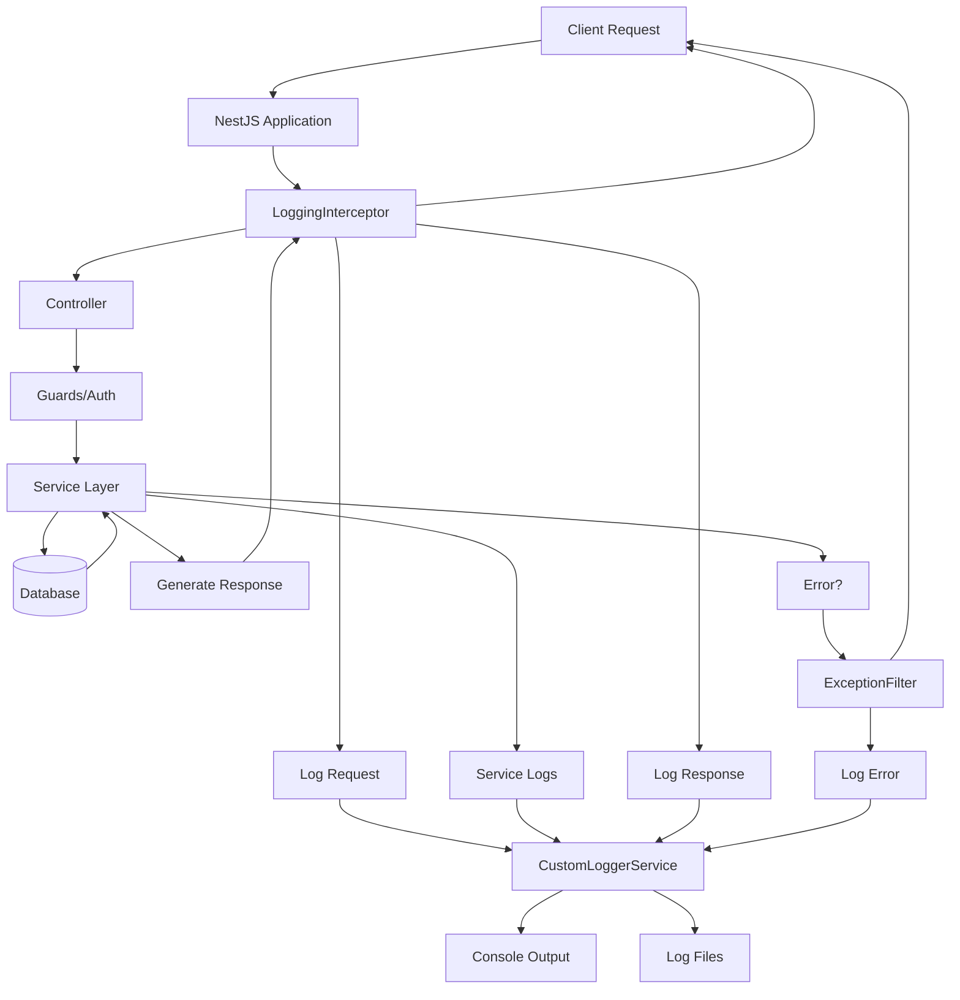

# Logging System Architecture

## Overview

This document explains how the logging system works and how all components interact.

## Architecture Diagram



## Request Flow with Logging

### 1. Incoming Request

```
Client → Application → LoggingInterceptor
```

**What happens:**
- Request enters the application
- `LoggingInterceptor` captures request details
- Logs: method, URL, headers, body, IP, timestamp
- Sanitizes sensitive data (passwords, tokens)

**Log Output:**
```json
{
  "type": "REQUEST",
  "method": "POST",
  "url": "/auth/login",
  "ip": "::1",
  "body": { "email": "user@example.com", "password": "***REDACTED***" }
}
```

### 2. Request Processing

```
LoggingInterceptor → Controller → Guard → Service
```

**What happens:**
- Request passes through guards (authentication)
- Reaches controller
- Controller calls service methods
- Service logs business events

**Service Log Output:**
```
[AuthService] Validating employee: user@example.com
[AuthService] Employee validated successfully
[AuthService] Login successful for employee: user@example.com
```

### 3. Response Generation

```
Service → Controller → LoggingInterceptor → Client
```

**What happens:**
- Service returns data
- `LoggingInterceptor` captures response
- Logs: status code, response data, response time
- Sanitizes sensitive data

**Log Output:**
```json
{
  "type": "RESPONSE",
  "method": "POST",
  "url": "/auth/login",
  "statusCode": 200,
  "responseTime": "245ms",
  "response": { "accessToken": "***REDACTED***" }
}
```

### 4. Error Handling

```
Service → Exception → ExceptionFilter → Logger → Client
```

**What happens:**
- If error occurs anywhere
- `AllExceptionsFilter` catches it
- Logs full error details with stack trace
- Returns formatted error response

**Error Log Output:**
```json
{
  "type": "ERROR",
  "statusCode": 401,
  "error": {
    "message": "Invalid credentials",
    "stack": "UnauthorizedException: Invalid credentials..."
  }
}
```

## Component Responsibilities

### CustomLoggerService
**Location:** `src/common/logger/logger.service.ts`

**Responsibilities:**
- Core logging functionality
- Console output with colors
- File writing (by level and date)
- Log directory management
- Old log cleanup

**Methods:**
- `log()` - INFO level
- `error()` - ERROR level
- `warn()` - WARN level
- `debug()` - DEBUG level
- `verbose()` - VERBOSE level
- `cleanOldLogs()` - Remove old log files

### LoggingInterceptor
**Location:** `src/common/interceptors/logging.interceptor.ts`

**Responsibilities:**
- Intercept all HTTP requests
- Log request details
- Log response details
- Calculate response time
- Sanitize sensitive data

**Sanitizes:**
- Request body: password, token, refreshToken, accessToken
- Headers: authorization, cookie, x-api-key
- Response: same as request body

### AllExceptionsFilter
**Location:** `src/common/filters/http-exception.filter.ts`

**Responsibilities:**
- Catch all unhandled exceptions
- Log error details with stack trace
- Format error response
- Include request context

**Logs:**
- Error message
- Error type/name
- Stack trace
- Request method and URL
- Request body

### LoggerModule
**Location:** `src/common/logger/logger.module.ts`

**Responsibilities:**
- Make logger available globally
- Manage logger dependencies
- Export logger for injection

## Data Flow

### Request Logging Flow

```
1. HTTP Request arrives
   ↓
2. LoggingInterceptor.intercept() called
   ↓
3. Capture request details (method, URL, body, headers)
   ↓
4. Sanitize sensitive data
   ↓
5. Format as JSON
   ↓
6. Call logger.log()
   ↓
7. CustomLoggerService writes to:
   - Console (colored)
   - File: YYYY-MM-DD-info.log
   - File: YYYY-MM-DD-combined.log
```

### Response Logging Flow

```
1. Service returns response
   ↓
2. LoggingInterceptor.intercept() captures response
   ↓
3. Calculate response time (end - start)
   ↓
4. Sanitize response data
   ↓
5. Format as JSON with status code, time
   ↓
6. Call logger.log()
   ↓
7. CustomLoggerService writes to files
```

### Error Logging Flow

```
1. Exception thrown
   ↓
2. AllExceptionsFilter.catch() called
   ↓
3. Extract error details (message, stack, status)
   ↓
4. Add request context
   ↓
5. Format error log
   ↓
6. Call logger.error() with stack trace
   ↓
7. CustomLoggerService writes to:
   - Console (red)
   - File: YYYY-MM-DD-error.log
   - File: YYYY-MM-DD-combined.log
   ↓
8. Return formatted error response to client
```

## File Structure

### Log Directory Organization

```
logs/
├── 2025-10-23-error.log         ← Only ERROR level
├── 2025-10-23-warn.log          ← Only WARN level
├── 2025-10-23-info.log          ← Only INFO level
├── 2025-10-23-debug.log         ← Only DEBUG level
├── 2025-10-23-verbose.log       ← Only VERBOSE level
├── 2025-10-23-combined.log      ← All levels
└── [older logs...]
```

### Log File Format

Each line is a complete JSON object:

```json
{"timestamp":"2025-10-23T10:30:45.123Z","level":"INFO","context":"HTTP","message":"..."}
{"timestamp":"2025-10-23T10:30:45.234Z","level":"INFO","context":"AuthService","message":"..."}
{"timestamp":"2025-10-23T10:30:45.345Z","level":"ERROR","context":"HTTP","message":"...","trace":"..."}
```

## Integration Points

### Application Bootstrap (main.ts)

```typescript
1. Create NestJS application
   ↓
2. Resolve CustomLoggerService
   ↓
3. Set global logger (app.useLogger)
   ↓
4. Register LoggingInterceptor (app.useGlobalInterceptors)
   ↓
5. Register AllExceptionsFilter (app.useGlobalFilters)
   ↓
6. Start application
   ↓
7. Log startup message
   ↓
8. Clean old logs
```

### Module Integration (app.module.ts)

```typescript
AppModule
├── ConfigModule (global)
├── TypeOrmModule (database)
├── LoggerModule (global) ← Makes logger available everywhere
├── EmployeeModule
└── AuthModule
```

### Service Integration

```typescript
@Injectable()
export class YourService {
  constructor(
    private readonly logger: CustomLoggerService  ← Inject logger
  ) {
    this.logger.setContext('YourService');  ← Set context
  }

  async yourMethod() {
    this.logger.log('Event happened');  ← Log events
  }
}
```

## Log Levels Hierarchy

```
VERBOSE  ← Most detailed (development)
   ↑
DEBUG    ← Debug information
   ↑
INFO     ← General information (default)
   ↑
WARN     ← Warnings
   ↑
ERROR    ← Errors only (least verbose)
```

## Console Output Colors

```
ERROR   → Red    (🔴)
WARN    → Yellow (🟡)
INFO    → Green  (🟢)
DEBUG   → Cyan   (🔵)
VERBOSE → Magenta (🟣)
```

## Sanitization Strategy

### Request/Response Body Sanitization

```
Original:
{
  "email": "user@example.com",
  "password": "secret123",
  "firstName": "John"
}

Sanitized:
{
  "email": "user@example.com",
  "password": "***REDACTED***",  ← Removed
  "firstName": "John"
}
```

### Header Sanitization

```
Original:
{
  "authorization": "Bearer eyJhbGc...",
  "content-type": "application/json",
  "x-api-key": "secret-key"
}

Sanitized:
{
  "authorization": "***REDACTED***",  ← Removed
  "content-type": "application/json",
  "x-api-key": "***REDACTED***"      ← Removed
}
```

## Performance Characteristics

### Console Logging
- **Speed:** Near-instant (synchronous)
- **Impact:** Negligible
- **Use case:** Development, debugging

### File Logging
- **Speed:** Fast (synchronous append)
- **Impact:** Minimal (~1-2ms per log)
- **Use case:** Production, audit trail

### HTTP Interception
- **Overhead:** ~1-5ms per request
- **Impact:** < 1% of total request time
- **Trade-off:** Worth it for complete visibility

## Log Lifecycle

### Creation
```
1. Event occurs
2. Logger method called (log, error, warn, etc.)
3. Log entry created with timestamp, level, context
4. Console output (colored)
5. File output (JSON)
```

### Storage
```
1. Log files organized by date (YYYY-MM-DD)
2. Separated by level (error, warn, info, etc.)
3. Combined log contains everything
4. JSON format for machine readability
```

### Cleanup
```
1. On application startup
2. cleanOldLogs() called
3. Check file modification dates
4. Delete files older than retention period (default: 30 days)
5. Log cleanup events
```

## Extension Points

### Add New Log Destination

```typescript
// In logger.service.ts
private fileLog(entry: LogEntry) {
  // Existing: Write to file
  fs.appendFileSync(logFilePath, logLine);
  
  // New: Send to external service
  this.sendToLogService(entry);
}
```

### Add Custom Context

```typescript
// In your service
this.logger.setContext('MyService');
this.logger.log('Custom event');
// Output: [MyService] Custom event
```

### Add Metadata

```typescript
// In your service
this.logger.log({
  message: 'Event',
  metadata: { userId: 123, action: 'login' }
});
```

## Best Practices

### DO:
✅ Set appropriate context for each service
✅ Log important business events
✅ Use appropriate log levels
✅ Include relevant data in messages
✅ Log errors with stack traces

### DON'T:
❌ Log inside tight loops
❌ Log sensitive data manually (auto-sanitized)
❌ Over-log in production
❌ Log PII without redaction
❌ Ignore log file size

## Monitoring Integration

The JSON log format makes integration easy:

### ELK Stack
```bash
# Configure Filebeat to ship logs to Elasticsearch
filebeat.inputs:
  - type: log
    paths:
      - /path/to/logs/*.log
    json.keys_under_root: true
```

### Datadog
```bash
# Point Datadog agent to logs directory
logs:
  - type: file
    path: /path/to/logs/*.log
    service: nest-app
    source: nodejs
```

### CloudWatch
```bash
# Use CloudWatch agent
[logs]
log_group_name = /aws/nestjs/app
file = /path/to/logs/*.log
```

## Summary

The logging system provides:

1. **Automatic HTTP Logging** - All requests/responses
2. **Service Event Logging** - Business logic events
3. **Error Tracking** - All exceptions with stack traces
4. **Multiple Outputs** - Console (dev) + Files (prod)
5. **Security** - Automatic sensitive data redaction
6. **Performance** - Minimal overhead
7. **Scalability** - File-based with rotation
8. **Integration** - JSON format for monitoring tools

All with **zero configuration** required - just start the app!
